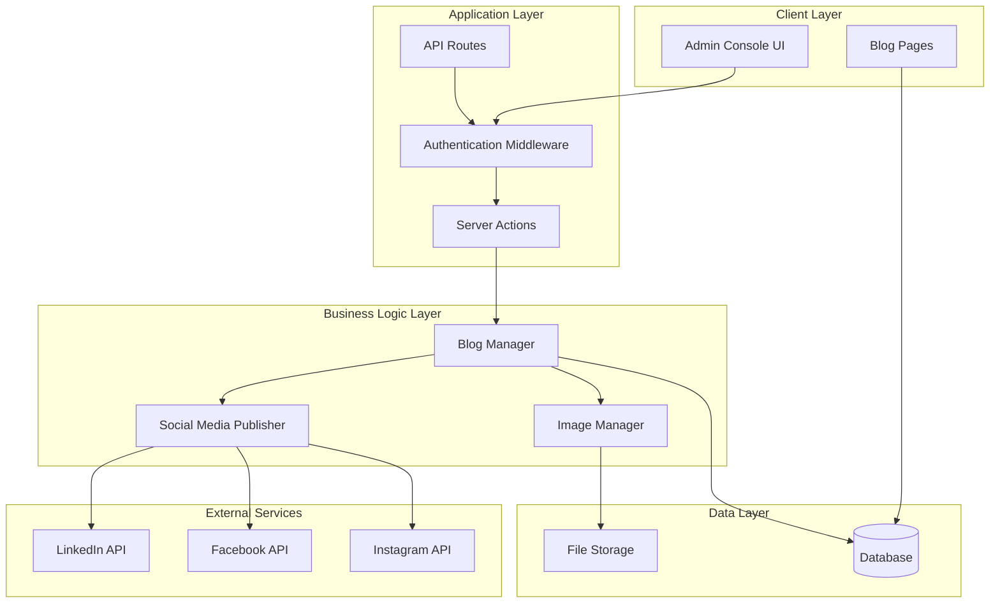

# Design Document: Admin Blog and Social Media Integration

## Overview

This system adds a secure admin console to the existing Next.js website, enabling administrators to create blog posts and automatically publish them to LinkedIn, Facebook, and Instagram. The design follows a modular architecture with clear separation between authentication, content management, social media integration, and presentation layers.

The system leverages Next.js 14 App Router features including Server Actions for secure API operations, Server Components for optimal performance, and API routes for webhook handling. Content is stored in a database (recommended: Vercel Postgres or similar), and social media publishing is handled through official platform APIs with proper error handling and retry logic.

## Architecture

### High-Level Architecture



### Technology Stack

- **Frontend**: React 18, Next.js 14 App Router, TailwindCSS, Framer Motion
- **Backend**: Next.js Server Actions, API Routes
- **Database**: Vercel Postgres (or PostgreSQL-compatible)
- **File Storage**: Vercel Blob Storage (or S3-compatible)
- **Authentication**: NextAuth.js v5 (Auth.js)
- **Social Media SDKs**: 
  - `linkedin-api-client` or direct REST API calls
  - `facebook-nodejs-business-sdk` or Graph API
  - Instagram Graph API (via Facebook)
- **Form Handling**: React Hook Form (already in dependencies)
- **Rich Text Editor**: Tiptap or Lexical (lightweight, extensible)
- **Image Processing**: Sharp (for optimization and resizing)

## Components and Interfaces

### 1. Authentication System

**Purpose**: Secure access control for the admin console

**Components**:
- `AuthProvider`: NextAuth.js configuration with credentials provider
- `AdminMiddleware`: Route protection for `/admin/*` paths
- `SessionManager`: Server-side session validation

**Interface**:
```typescript
interface AuthConfig {
  providers: Provider[];
  callbacks: {
    authorized: (params: { auth: Session | null; request: NextRequest }) => boolean;
  };
  pages: {
    signIn: string;
  };
}

interface AdminSession extends Session {
  user: {
    id: string;
    email: string;
    role: 'admin';
  };
}
```

### 2. Blog Management System

**Purpose**: Handle blog post creation, storage, and retrieval

**Components**:
- `BlogPostEditor`: React component for content creation
- `BlogPostService`: Business logic for CRUD operations
- `BlogPostRepository`: Database access layer

**Interface**:
```typescript
interface BlogPost {
  id: string;
  title: string;
  content: string;
  excerpt?: string;
  slug: string;
  authorId: string;
  images: BlogImage[];
  status: 'draft' | 'published';
  publishedAt?: Date;
  createdAt: Date;
  updatedAt: Date;
  socialMediaPosts: SocialMediaPost[];
}

interface BlogImage {
  id: string;
  url: string;
  altText: string;
  width: number;
  height: number;
  order: number;
}

interface BlogPostService {
  create(data: CreateBlogPostInput): Promise<BlogPost>;
  update(id: string, data: UpdateBlogPostInput): Promise<BlogPost>;
  publish(id: string): Promise<BlogPost>;
  getById(id: string): Promise<BlogPost | null>;
  list(filters: BlogPostFilters): Promise<BlogPost[]>;
  delete(id: string): Promise<void>;
}
```

### 3. Social Media Integration System

**Purpose**: Publish content to LinkedIn, Facebook, and Instagram

**Components**:
- `SocialMediaPublisher`: Orchestrates publishing to all platforms
- `LinkedInClient`: LinkedIn API integration
- `FacebookClient`: Facebook Graph API integration
- `InstagramClient`: Instagram Graph API integration
- `PublishQueue`: Manages async publishing with retry logic

**Interface**:
```typescript
interface SocialMediaPublisher {
  publishToAll(post: BlogPost): Promise<PublishResult[]>;
  publishToLinkedIn(post: BlogPost): Promise<PublishResult>;
  publishToFacebook(post: BlogPost): Promise<PublishResult>;
  publishToInstagram(post: BlogPost): Promise<PublishResult>;
}

interface PublishResult {
  platform: 'linkedin' | 'facebook' | 'instagram';
  success: boolean;
  postUrl?: string;
  postId?: string;
  error?: string;
  publishedAt?: Date;
}

interface SocialMediaPost {
  id: string;
  blogPostId: string;
  platform: 'linkedin' | 'facebook' | 'instagram';
  platformPostId: string;
  postUrl: string;
  status: 'pending' | 'published' | 'failed';
  error?: string;
  publishedAt?: Date;
  createdAt: Date;
}

interface PlatformClient {
  authenticate(): Promise<void>;
  createPost(content: PostContent): Promise<PlatformPostResponse>;
  uploadMedia(file: Buffer, metadata: MediaMetadata): Promise<string>;
}

interface PostContent {
  text: string;
  images?: string[];
  link?: string;
}
```

### 4. Image Management System

**Purpose**: Handle image uploads, optimization, and storage

**Components**:
- `ImageUploader`: React component for file selection and upload
- `ImageProcessor`: Server-side image optimization
- `ImageStorage`: Interface to blob storage

**Interface**:
```typescript
interface ImageManager {
  upload(file: File): Promise<BlogImage>;
  optimize(buffer: Buffer, options: OptimizeOptions): Promise<Buffer>;
  delete(imageId: string): Promise<void>;
  getUrl(imageId: string): string;
}

interface OptimizeOptions {
  maxWidth: number;
  maxHeight: number;
  quality: number;
  format: 'jpeg' | 'png' | 'webp';
}

interface UploadResult {
  id: string;
  url: string;
  width: number;
  height: number;
}
```

### 5. Admin Console UI

**Purpose**: Provide the user interface for content creation and management

**Components**:
- `AdminLayout`: Protected layout wrapper
- `BlogPostEditor`: Main editing interface
- `RichTextEditor`: Text formatting component
- `ImageUploadZone`: Drag-and-drop image upload
- `PublishPanel`: Publishing controls and status display
- `BlogPostList`: List view of all posts
- `PreviewModal`: Post preview before publishing

**Key Features**:
- Single-page editor with auto-save to drafts
- Real-time preview toggle
- Image upload with drag-and-drop
- Publishing status indicators
- Error notifications with retry options

## Data Models

### Database Schema

```sql
-- Users table (for authentication)
CREATE TABLE users (
  id UUID PRIMARY KEY DEFAULT gen_random_uuid(),
  email VARCHAR(255) UNIQUE NOT NULL,
  password_hash VARCHAR(255) NOT NULL,
  role VARCHAR(50) NOT NULL DEFAULT 'admin',
  created_at TIMESTAMP DEFAULT NOW(),
  updated_at TIMESTAMP DEFAULT NOW()
);

-- Blog posts table
CREATE TABLE blog_posts (
  id UUID PRIMARY KEY DEFAULT gen_random_uuid(),
  title VARCHAR(500) NOT NULL,
  content TEXT NOT NULL,
  excerpt TEXT,
  slug VARCHAR(500) UNIQUE NOT NULL,
  author_id UUID REFERENCES users(id),
  status VARCHAR(50) NOT NULL DEFAULT 'draft',
  published_at TIMESTAMP,
  created_at TIMESTAMP DEFAULT NOW(),
  updated_at TIMESTAMP DEFAULT NOW()
);

-- Blog images table
CREATE TABLE blog_images (
  id UUID PRIMARY KEY DEFAULT gen_random_uuid(),
  blog_post_id UUID REFERENCES blog_posts(id) ON DELETE CASCADE,
  url TEXT NOT NULL,
  alt_text VARCHAR(500),
  width INTEGER NOT NULL,
  height INTEGER NOT NULL,
  display_order INTEGER NOT NULL,
  created_at TIMESTAMP DEFAULT NOW()
);

-- Social media posts table
CREATE TABLE social_media_posts (
  id UUID PRIMARY KEY DEFAULT gen_random_uuid(),
  blog_post_id UUID REFERENCES blog_posts(id) ON DELETE CASCADE,
  platform VARCHAR(50) NOT NULL,
  platform_post_id VARCHAR(255),
  post_url TEXT,
  status VARCHAR(50) NOT NULL DEFAULT 'pending',
  error TEXT,
  published_at TIMESTAMP,
  created_at TIMESTAMP DEFAULT NOW(),
  updated_at TIMESTAMP DEFAULT NOW()
);

-- Indexes for performance
CREATE INDEX idx_blog_posts_status ON blog_posts(status);
CREATE INDEX idx_blog_posts_published_at ON blog_posts(published_at DESC);
CREATE INDEX idx_blog_posts_slug ON blog_posts(slug);
CREATE INDEX idx_social_media_posts_blog_post_id ON social_media_posts(blog_post_id);
CREATE INDEX idx_social_media_posts_platform ON social_media_posts(platform);
```

### File Storage Structure

```
/blog-images/
  /{blog-post-id}/
    /original/
      {image-id}.{ext}
    /optimized/
      {image-id}-{width}x{height}.webp
      {image-id}-{width}x{height}.jpg
```

## Cor
rectness Properties

*A property is a characteristic or behavior that should hold true across all valid executions of a system—essentially, a formal statement about what the system should do. Properties serve as the bridge between human-readable specifications and machine-verifiable correctness guarantees.*

### Authentication Properties

**Property 1: Unauthenticated access protection**
*For any* admin route URL, when accessed without valid authentication, the system should redirect to the login page
**Validates: Requirements 1.1**

**Property 2: Valid credentials grant access**
*For any* valid administrator credentials, authentication should succeed and create a valid session that grants access to the admin console
**Validates: Requirements 1.2**

**Property 3: Logout invalidates session**
*For any* authenticated session, after logout, that session should be invalid and all subsequent requests should be denied until re-authentication
**Validates: Requirements 1.4**

### Content Management Properties

**Property 4: Text formatting preservation**
*For any* text content containing paragraphs, line breaks, and special characters, the content editor should preserve all formatting when saved and retrieved
**Validates: Requirements 2.2**

**Property 5: Draft persistence without publication**
*For any* blog post saved as a draft, the content should be persisted to the database with status 'draft' and published_at should remain null
**Validates: Requirements 2.4**

**Property 6: Input validation enforcement**
*For any* blog post submission with an empty title or content below minimum length, the validation should reject the submission and return appropriate error messages
**Validates: Requirements 2.5**

### Image Management Properties

**Property 7: Image format validation**
*For any* uploaded file, if the file format is not JPEG, PNG, GIF, or WebP, the upload should be rejected with an appropriate error message
**Validates: Requirements 3.2**

**Property 8: Image upload round trip**
*For any* valid image file uploaded, the system should store it and return a preview URL that resolves to the uploaded image
**Validates: Requirements 3.3**

**Property 9: Image size constraint enforcement**
*For any* uploaded image exceeding maximum dimensions, the system should resize it to meet platform requirements while maintaining aspect ratio
**Validates: Requirements 3.4**

**Property 10: Image order preservation**
*For any* sequence of uploaded images, the display order should match the upload order when retrieved
**Validates: Requirements 3.5**

### Social Media Publishing Properties

**Property 11: LinkedIn content formatting**
*For any* blog post published to LinkedIn, the formatted content should conform to LinkedIn API specifications including character limits and formatting rules
**Validates: Requirements 4.2**

**Property 12: LinkedIn image inclusion**
*For any* blog post containing images published to LinkedIn, all images should be uploaded to LinkedIn and included in the post
**Validates: Requirements 4.3**

**Property 13: Facebook content formatting**
*For any* blog post published to Facebook, the formatted content should conform to Facebook Graph API specifications including character limits and formatting rules
**Validates: Requirements 5.2**

**Property 14: Facebook image inclusion**
*For any* blog post containing images published to Facebook, all images should be uploaded to Facebook and included in the post
**Validates: Requirements 5.3**

**Property 15: Instagram caption formatting**
*For any* blog post published to Instagram, the content should be formatted as a caption conforming to Instagram API specifications including character limits and hashtag rules
**Validates: Requirements 6.2**

**Property 16: Instagram carousel creation**
*For any* blog post with multiple images published to Instagram, the system should create a carousel post containing all images in order
**Validates: Requirements 6.3**

**Property 17: Publication success recording**
*For any* successful social media post to any platform, the system should record the post URL, platform post ID, and publication timestamp in the database
**Validates: Requirements 4.4, 5.4, 6.4**

**Property 18: Publication error handling**
*For any* failed social media post to any platform, the system should log the error details, update the post status to 'failed', and make the error visible to the administrator
**Validates: Requirements 4.5, 5.5**

### Status Display Properties

**Property 19: Publication status visibility**
*For any* blog post with social media publications, the admin console should display the current status (pending, published, or failed) for each platform
**Validates: Requirements 7.1, 7.2, 7.3, 7.5**

**Property 20: Publication history completeness**
*For any* published blog post, the publication history should include all required information: timestamps, platform-specific URLs, and status for each platform
**Validates: Requirements 7.4**

### Blog Storage and Display Properties

**Property 21: Complete blog post persistence**
*For any* published blog post, the stored record should include all required fields: unique identifier, title, content, images, publication timestamp, and author information
**Validates: Requirements 8.1, 8.2**

**Property 22: Chronological blog ordering**
*For any* set of published blog posts, when displayed on the blog section, they should be ordered by publication date in descending order (newest first)
**Validates: Requirements 8.3**

**Property 23: Complete post rendering**
*For any* individual blog post page, all content including title, full text, and all associated images should be displayed
**Validates: Requirements 8.4**

**Property 24: Sitemap inclusion**
*For any* newly published blog post, the sitemap should be updated to include the blog post URL
**Validates: Requirements 8.5**

### Preview Properties

**Property 25: Preview rendering consistency**
*For any* blog post content, the preview rendering should produce the same HTML output as the public website rendering
**Validates: Requirements 9.2**

**Property 26: Preview image display**
*For any* blog post with images, the preview should display all images at their intended sizes and in the correct positions
**Validates: Requirements 9.3**

**Property 27: Preview reactivity**
*For any* content change in the editor, the preview should update to reflect the changes
**Validates: Requirements 9.4**

**Property 28: Preview state preservation**
*For any* blog post being edited, toggling between edit and preview modes should preserve all content without data loss
**Validates: Requirements 9.5**

### Security Properties

**Property 29: Credential encryption at rest**
*For any* API credentials stored in the system, the stored values should be encrypted and not readable in plaintext
**Validates: Requirements 10.1**

**Property 30: Credential logging prevention**
*For any* application logs, decrypted API credentials should never appear in log output
**Validates: Requirements 10.2**

**Property 31: Environment-based configuration**
*For any* API credentials used by the system, they should be loaded from environment variables and not hardcoded in source code
**Validates: Requirements 10.4**

**Property 32: Automatic token refresh**
*For any* expired API token on a platform that supports refresh tokens, the system should automatically refresh the token before making API calls
**Validates: Requirements 10.5**

## Error Handling

### Error Categories

1. **Authentication Errors**
   - Invalid credentials
   - Session expiration
   - Insufficient permissions
   - Response: Redirect to login with error message

2. **Validation Errors**
   - Empty title or content
   - Invalid image format
   - Content too long for platform
   - Response: Display inline validation errors, prevent submission

3. **Upload Errors**
   - File too large
   - Unsupported format
   - Storage quota exceeded
   - Response: Show error notification, allow retry

4. **Social Media API Errors**
   - Authentication failure
   - Rate limiting
   - Network timeout
   - Invalid content format
   - Response: Log error, update status, show notification with retry option

5. **Database Errors**
   - Connection failure
   - Constraint violation
   - Query timeout
   - Response: Show error notification, preserve user data, allow retry

### Error Handling Strategy

```typescript
interface ErrorHandler {
  handle(error: AppError): ErrorResponse;
  retry(operation: () => Promise<any>, maxAttempts: number): Promise<any>;
  notify(error: AppError, user: User): void;
}

interface AppError {
  code: string;
  message: string;
  category: ErrorCategory;
  retryable: boolean;
  details?: Record<string, any>;
}

interface ErrorResponse {
  success: false;
  error: {
    code: string;
    message: string;
    userMessage: string;
    retryable: boolean;
  };
}
```

**Retry Logic**:
- Social media API calls: 3 attempts with exponential backoff
- Database operations: 2 attempts with 1-second delay
- Image uploads: 2 attempts with 2-second delay
- No retry for validation errors

**Error Logging**:
- All errors logged to Sentry (already configured)
- Include context: user ID, operation, timestamp
- Sanitize sensitive data before logging
- Track error rates and patterns

## Testing Strategy

### Unit Testing

The system will use Vitest (already configured) for unit testing. Unit tests will focus on:

**Authentication Module**:
- Session validation logic
- Credential verification
- Token generation and validation

**Blog Post Service**:
- CRUD operations
- Slug generation
- Status transitions (draft → published)

**Image Processing**:
- Format validation
- Resize and optimization logic
- File size calculations

**Social Media Clients**:
- Content formatting functions
- API request construction
- Response parsing
- Error handling logic

**Example Unit Tests**:
```typescript
describe('BlogPostService', () => {
  it('should generate unique slug from title', () => {
    const title = 'My Blog Post!';
    const slug = generateSlug(title);
    expect(slug).toBe('my-blog-post');
  });

  it('should reject empty title', async () => {
    await expect(
      blogPostService.create({ title: '', content: 'test' })
    ).rejects.toThrow('Title cannot be empty');
  });
});
```

### Property-Based Testing

The system will use `fast-check` for property-based testing in TypeScript. Each property-based test will:
- Run a minimum of 100 iterations
- Be tagged with a comment referencing the design document property
- Use the format: `**Feature: admin-blog-social-integration, Property {number}: {property_text}**`

**Property Test Examples**:

```typescript
import fc from 'fast-check';

describe('Property Tests', () => {
  /**
   * Feature: admin-blog-social-integration, Property 4: Text formatting preservation
   * Validates: Requirements 2.2
   */
  it('should preserve text formatting for any content', () => {
    fc.assert(
      fc.property(
        fc.string({ minLength: 1, maxLength: 5000 }),
        async (content) => {
          const saved = await blogPostService.create({
            title: 'Test',
            content
          });
          const retrieved = await blogPostService.getById(saved.id);
          expect(retrieved.content).toBe(content);
        }
      ),
      { numRuns: 100 }
    );
  });

  /**
   * Feature: admin-blog-social-integration, Property 10: Image order preservation
   * Validates: Requirements 3.5
   */
  it('should maintain image order for any sequence', () => {
    fc.assert(
      fc.property(
        fc.array(fc.record({
          url: fc.webUrl(),
          altText: fc.string()
        }), { minLength: 1, maxLength: 10 }),
        async (images) => {
          const post = await blogPostService.create({
            title: 'Test',
            content: 'Test',
            images: images.map((img, idx) => ({ ...img, order: idx }))
          });
          const retrieved = await blogPostService.getById(post.id);
          expect(retrieved.images.map(i => i.url)).toEqual(images.map(i => i.url));
        }
      ),
      { numRuns: 100 }
    );
  });
});
```

### Integration Testing

Integration tests will verify:
- End-to-end blog post creation and publishing flow
- Social media API integration (using test accounts)
- Database operations with real database connection
- Image upload and storage pipeline
- Authentication flow from login to authorized action

### Testing Social Media APIs

**Approach**:
1. Use official test/sandbox accounts for each platform
2. Create mock API servers for local development
3. Use environment variables to switch between real and mock APIs
4. Implement cleanup scripts to delete test posts

**Mock API Structure**:
```typescript
interface MockSocialMediaAPI {
  linkedin: MockLinkedInAPI;
  facebook: MockFacebookAPI;
  instagram: MockInstagramAPI;
}

// Returns predictable responses for testing
// Supports error simulation for testing error handling
```

## Implementation Phases

### Phase 1: Foundation (Core Infrastructure)
- Database schema and migrations
- Authentication system with NextAuth.js
- Basic admin layout and routing
- Environment configuration

### Phase 2: Blog Management
- Blog post CRUD operations
- Rich text editor integration
- Draft/publish workflow
- Blog post listing and detail pages

### Phase 3: Image Management
- Image upload component
- Image processing and optimization
- Storage integration (Vercel Blob)
- Image gallery in editor

### Phase 4: Social Media Integration
- LinkedIn API client
- Facebook API client
- Instagram API client
- Publishing orchestration
- Error handling and retry logic

### Phase 5: Status and Monitoring
- Publication status display
- Error notifications
- Publication history
- Admin dashboard

### Phase 6: Polish and Testing
- Preview functionality
- Comprehensive testing
- Performance optimization
- Documentation

## Security Considerations

1. **Authentication**:
   - Use NextAuth.js with secure session management
   - Implement CSRF protection
   - Rate limit login attempts
   - Use secure password hashing (bcrypt)

2. **Authorization**:
   - Verify admin role on every protected route
   - Use middleware for consistent enforcement
   - Implement principle of least privilege

3. **Data Protection**:
   - Encrypt API credentials at rest
   - Use environment variables for secrets
   - Sanitize user input to prevent XSS
   - Implement SQL injection protection (use parameterized queries)

4. **API Security**:
   - Store OAuth tokens securely
   - Implement token refresh logic
   - Use HTTPS for all external API calls
   - Validate API responses

5. **File Upload Security**:
   - Validate file types and sizes
   - Scan for malware (if budget allows)
   - Use signed URLs for storage access
   - Implement upload rate limiting

## Performance Considerations

1. **Image Optimization**:
   - Resize images on upload
   - Generate multiple sizes for responsive images
   - Use WebP format with JPEG fallback
   - Implement lazy loading

2. **Database Optimization**:
   - Index frequently queried columns
   - Use connection pooling
   - Implement query result caching
   - Paginate blog post lists

3. **API Calls**:
   - Implement request queuing
   - Use exponential backoff for retries
   - Cache API responses where appropriate
   - Batch operations when possible

4. **Frontend Performance**:
   - Code splitting for admin routes
   - Lazy load rich text editor
   - Optimize bundle size
   - Use React Server Components where possible

## Deployment Considerations

1. **Environment Variables**:
   ```
   # Authentication
   NEXTAUTH_SECRET=
   NEXTAUTH_URL=
   ADMIN_EMAIL=
   ADMIN_PASSWORD_HASH=
   
   # Database
   POSTGRES_URL=
   
   # Storage
   BLOB_READ_WRITE_TOKEN=
   
   # LinkedIn
   LINKEDIN_CLIENT_ID=
   LINKEDIN_CLIENT_SECRET=
   LINKEDIN_ACCESS_TOKEN=
   
   # Facebook
   FACEBOOK_APP_ID=
   FACEBOOK_APP_SECRET=
   FACEBOOK_ACCESS_TOKEN=
   
   # Instagram
   INSTAGRAM_BUSINESS_ACCOUNT_ID=
   INSTAGRAM_ACCESS_TOKEN=
   ```

2. **Database Migrations**:
   - Use a migration tool (e.g., Prisma, Drizzle)
   - Version control all migrations
   - Test migrations in staging first

3. **Monitoring**:
   - Use Sentry for error tracking (already configured)
   - Monitor API rate limits
   - Track publication success rates
   - Set up alerts for critical failures

4. **Backup Strategy**:
   - Regular database backups
   - Store images in redundant storage
   - Keep audit logs of all publications
